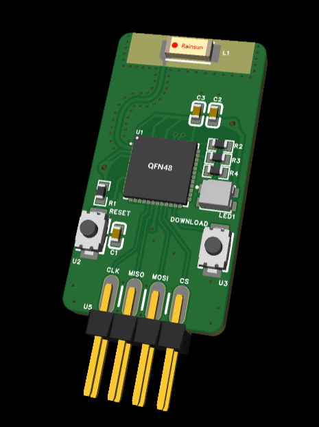

# 基于ESP32的多协议转WiFi图传模块

> 本项目为基于乐鑫公司的 ESP32-pico-d4 芯片制作的无线模块，具有多个通信协议接口：UART、SPI、SDIO。设计初衷是为了方便智能车比赛的摄像头算法调试，通过和上位机配合降低调试难度

由于芯片名称里有一个 pico 单词而且本项目和图像有关，所以将该模块取名为 Pic-o Link

该模块的一大特点是可以兼容逐飞的无线串口接口，具有硬件流控功能，并且可以直接使用逐飞的无线串口驱动实现单向通信，免去了车友们测试该模块需要重新制板的需要

> esp32 硬件支持 5Mbps UART 和 10Mbps SPI slave

**目前仅支持单向发送到上位机**

上位机见另一位大佬的 https://gitee.com/zhou-wenqi/ipc-for-car.git

本项目还处于雏形，代码硬件还比较粗糙，欢迎各位大佬来交流和提出改进意见，本人B站id：卜林小子

B 站视频：

可直接购买实物，附赠进阶版的上位机以及使用指导：

**PCB 仿真如下**

|     类别     |                    原版（UART+SPI+SDIO）                     | 兼容逐飞无线串口接口（去除SDIO）                             |
| :----------: | :----------------------------------------------------------: | ------------------------------------------------------------ |
|   3D仿真图   |  |  |
| 立创开源链接 |                                                              |                                                              |

**焊接效果还可以**

|  |  |
| ------------------------------------------------------------ | ------------------------------------------------------------ |

## Pic-o Link

### 硬件（立创EDA-专业版）

- 基于 esp32-pico-d4
- spi 接口
- uart 接口
- sdio 接口
- 一个复位按键
- 一个下载按键
- 电源指示灯
- rgb 三色灯
- 5V 电源输入，3.3V 电源稳压

**接口及PCB绘制要求**

- 接口：2.54mm 2x4或5p 排母
- 5V 电源至少要保证 500mA 的输出电流

### 固件（基于 espressif 框架）

**三种通信模式固件**

- **UART** 最大5Mbps

  - **透传模式** 指传输数据没有固定的字节数限制，每次通信可以传输各种大小的数据，更加灵活

    使用透传模式建议发送间隔大于 `串口传输时间` + 20ms

  - **图传模式** 指传输数据有固定的字节数限制，速度比透传模式更快，但只能传输固定大小的数据

    使用图传模式建议发送间隔大于 `串口传输时间`，并且 **Pic-o Link RTS 引脚要与发送端 CTS 引脚相连实现硬件流控（或者直接参考逐飞无线串口接口的原理图）**

    两种模式通过在固件中修改 `uart_read_bytes`() 函数的 `length` 参数切换

    `length` 参数为缓冲区大小 `RX_BUF_SIZE-1` 时为透传模式

    `length` 参数为要发送的固定数据的字节数时为图传模式，例如传输60x90灰度图时为5400

- **SPI** 最大10Mbps

- **SDIO**（待开发）

**固件可以自定义的参数**

- Pic-o Link 连接的 WiFi 账号即密码
- 上位机 udp server 的 IP 地址以及端口（**上位机需与 Pic-o Link 处于同一网段**）

**如何打开固件工程？**

- 使用 VS code 的 Plaform IO 插件

**如何进入下载模式？**

- 按住 DOWNLOAD 键不放再按一下 RESET 键，rgb 灯不亮即进入了下载模式，可以点击 Platform IO 的下载按键一键编译下载，下载完毕后一定要记得按 RESET 键

### 工作流程

1. 上电
2. nvs flash 初始化
3. 设置为 STA 模式
4. WiFI 扫描模式，指示灯显示当前状态 -> 红
5. WiFi 连接成功，指示灯显示当前状态 -> 绿
6. 设置为 udp client 模式，指示灯显示当前状态 -> 蓝
7. 进入和下位机的通信模式
9. 传输数据时，指示灯显示当前状态 -> 白

## 使用情形

## 软件

- 基于 Qt C++ 的上位机

  见另一位大佬的 https://gitee.com/zhou-wenqi/ipc-for-car.git

- 简易的 python 脚本

  - 串口发送测试
  - 接收图像显示

- ESP 一键配网 app（一键配网尚未实现）

## 测试1

**固件**：**UART** 1.5Mbps 透传模式

> 由于电脑串口助手没有引出硬件流控引脚，所以在串口在发送大量数据时可能会丢失，图传模式固定的字节数可能达不到引发错误，所以电脑测试统一使用透传模式

使用电脑串口通信，电脑运行脚本 `.\software\monitor_python\serial_sender.py` 通过串口向 `Pic-o Link` 发送视频帧数据（`.\software\monitor_python\example1.mp4`）。为 90 x 60 灰度图，大小5400字节

电脑运行 `.\software\monitor_python\monitor_image.py` 脚本接收图像。

视频见文件 `.\image\测试1.mp4`，接收还原的视频平均帧数16.2帧，，实际串口发送延迟35ms

总共发送4555帧，出现14帧错误。错误率：0.3%

## 测试2

**固件**：**UART** 1.5Mbps 透传模式

使用电脑串口通信，电脑运行脚本 `.\software\monitor_python\serial_sender_color.py` 通过串口向 `Pic-o Link` 发送彩色视频帧数据（`.\software\monitor_python\example2.mp4`）。为 45 x 30 彩色图，大小不固定，平均3500字节。

电脑运行 `.\software\monitor_python\monitor_image_color.py` 脚本接收彩色图像。

视频见文件 `.\image\测试2.mp4`，接收还原的视频平均帧数20帧，实际串口发送延迟23ms

## 测试3

**固件**：**UART** 4Mbps 图传模式

使用 RT1064 通信，RT1064 固件为 `.\firmware\example\rt1064\UART` 工程。

电脑运行 `.\software\monitor_python\monitor_image.py` 脚本接收图像。

使用摄像头为总钻风摄像头，图像分辨率 90 x 60，摄像头帧数50帧。

RT1064 在主函数中刷新图像，通过定时器中断每30ms发送采集图像。实际测试上位机平均每30ms收到图像，帧数30帧左右。由于使用硬件流控没有出现图像数据缺失，视频见文件 `.\image\测试3.mp4`，由于是电脑大屏显示，所以 90x60 的图像显得有些模糊。芯片测试得发送一张灰度图用时15ms

## 测试4

**固件**：**SPI** 7Mbps

使用 RT1064 通信，RT1064 固件为 `.\firmware\example\rt1064\SPI` 工程。

电脑运行 `.\software\monitor_python\monitor_image.py` 脚本接收图像。

使用摄像头为总钻风摄像头，图像分辨率 90 x 60，摄像头帧数50帧。

RT1064 在主函数中刷新图像，通过定时器中断每30ms发送采集图像。实际测试上位机平均每30ms收到图像，帧数30帧左右。芯片测试得发送一张灰度图用时6ms

## 缺陷

- 发热比较严重
- UART 固件透传模式有一个固定的 20ms 延迟

## 后续计划

1. 加入一键配网功能
2. 编写 SDIO 固件
3. udp 改为分包发送
4. 实现全双工模式

## 其他资料

乐鑫官方测试的 ESP32 的 udp/tcp 速率：

| Type/Throughput      | Air In Lab | Shield-box     | Test Tool     | IDF Version (commit ID) |
| -------------------- | ---------- | -------------- | ------------- | ----------------------- |
| Raw 802.11 Packet RX | N/A        | **130 MBit/s** | Internal tool | NA                      |
| Raw 802.11 Packet TX | N/A        | **130 MBit/s** | Internal tool | NA                      |
| UDP RX               | 30 MBit/s  | 85 MBit/s      | iperf example | 15575346                |
| UDP TX               | 30 MBit/s  | 75 MBit/s      | iperf example | 15575346                |
| TCP RX               | 20 MBit/s  | 65 MBit/s      | iperf example | 15575346                |
| TCP TX               | 20 MBit/s  | 75 MBit/s      | iperf example | 15575346                |
