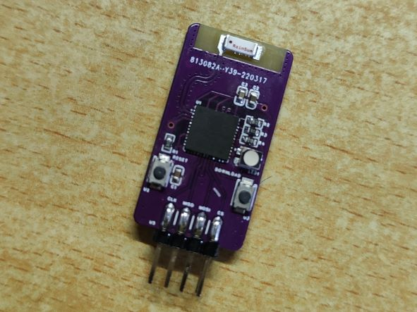

# 基于ESP32的多协议WiFi透传模块

[English](README.md) | [中文](README_cn.md)

> 本项目为基于乐鑫公司的 ESP32-pico-d4 芯片制作的无线模块，具有多个通信协议接口：UART、SPI。设计初衷是为了方便智能车比赛的摄像头算法调试，通过和上位机配合降低调试难度
>
> esp32 硬件支持 5Mbps UART 和 10Mbps SPI slave

该模块的一大特点是可以兼容逐飞的无线串口接口，具有硬件流控功能，并且可以直接使用逐飞的无线串口驱动实现单向通信，免去了车友们测试该模块需要重新制板的需要，**目前仅支持单向发送到上位机**

本项目软硬件比较粗糙，欢迎各位大佬来交流和提出改进意见，本人QQ：1626632460

**开源智能车图传上位机可以使用致用上位机**，**该模块主要配合该上位机使用**，**使用手册和单片机例程在这个上位机仓库里**，链接：https://gitee.com/zhou-wenqi/ipc-for-car

B站视频链接：https://www.bilibili.com/video/BV1oZ4y1m7y2

**PCB 仿真如下**

|     类别     |                           UART+SPI                           |
| :----------: | :----------------------------------------------------------: |
|   3D仿真图   |  |
|   焊接效果   |         |
| 立创开源链接 | https://oshwhub.com/Wander_er/891fe1d235694ef7afe684f5a2f05b73 |

## 目录结构

|   名称   |            作用            |
| :------: | :------------------------: |
|   doc    |          芯片文档          |
|  driver  |          驱动文件          |
| firmware |            固件            |
| hardware |            硬件            |
|  image   |            图片            |
| software | 简易图传上位机 python 脚本 |

## 硬件（立创EDA-专业版）

- 基于 esp32-pico-d4
- spi 接口
- uart 接口
- 一个复位按键
- 一个下载按键
- 电源指示灯
- rgb 三色灯
- 5V 电源输入，3.3V 电源稳压

## 固件（基于 ESP-IDF 框架）

**两种通信模式**

- **UART** 波特率最大5Mbps，**一次最多接收20000字节**

  使用串口轮询从缓冲区中提取接收数据，有两个参数，分别是接收缓冲区大小和最长等待时间，当接收的字节数达到缓冲区大小时立即视为完成一次接收；发送完毕但没有达到接收缓冲区大小时，则等待最长等待时间再视作完成一次传输，这个等待时间是固定的20ms

  所以可以视作具有两种模式，通过在固件中修改 `uart_read_bytes`() 函数的 `length` 参数切换

  - **透传模式**：指传输数据没有固定的字节数限制，每次通信可以传输各种大小的数据，更加灵活

    使用透传模式建议发送间隔大于 `串口传输时间` + `20ms` + `udp传输时间(速率按30Mbps算)`

    `length` 参数为缓冲区大小 `RX_BUF_SIZE-1` 时为透传模式，即假设没有数据会达到这个长度

  - **固定字节模式**：指传输数据有固定的字节数限制，速度比透传模式更快，但只能传输固定大小的数据

    使用固定字节模式建议发送间隔大于 `串口传输时间`  +  `udp传输时间(速率按30Mbps算)`

    `length` 参数为要发送的固定数据的字节数时为固定字节，例如传输 60 x 90 灰度图时为 5400

    > 当然，发送低于这个长度的数据时也可视作为透传模式

- **SPI** 波特率最大10Mbps，**一次最多接收25000字节**

  - 只支持4字节倍数长度的数据接收，SPI 模式为3
  - 建议发送间隔大于 `SPI传输时间` +  `udp传输时间(速率按30Mbps算)`

**固件集成了 UART 和 SPI 两种通信模式，可以通过串口通信协议配置参数写进Flash里，掉电不丢失，免去了反复修改固件的需要**

## 常见问题

**和下位机如何连线？**

- **UART**

  |   Pic-o Link    |                            下位机                            |
  | :-------------: | :----------------------------------------------------------: |
  |       RXD       |                             TXD                              |
  |       TXD       |                             RXD                              |
  | RTS (复用 MOSI) | CTS（没有的话影响不大，但是要在下位机串口传输函数里禁掉流控检测） |

- **SPI**

  | Pic-o Link | 下位机 |
  | :--------: | :----: |
  |    CLK     |  CLK   |
  |    MISO    |  MISO  |
  |    MOSI    |  MOSI  |
  |     CS     |   CS   |

- **5V 供电，地线必接**

**如何计算传完一张图像所用的时间？**

以 UART 3Mbps 传输 60 x 90 灰度图为例，首先计算图像的位数：60 x 90 x 8 = 43200 bits，再用位数除以波特率：43200 / 3000000  = 0.0144 s = 14.4 ms

**如何进入和使用配置模式？**

电脑使用 USB 转 TTL 串口助手连接 `Pic-o Link`，短接 `MOSI` 和 `CS` 引脚再复位，**rgb 指示灯显示黄色**代表进入配置模式，此时可以通过串口配置 Pic-o Link 参数，**波特率115200**，协议见表格

|             类别             |               备注               |   帧头   |  长度  |
| :--------------------------: | :------------------------------: | :------: | :----: |
|         通信协议选择         | 8位无符号整形，0 : UART, 1 : SPI | 0x41 (A) | 1字节  |
|     UART 通信模式波特率      |    32位无符号整形，<=5000000     | 0x42 (B) | 4字节  |
| UART 通信模式接收缓冲字节数  |     16位无符号整形，<=20000      | 0x43 (C) | 2字节  |
|          WiFi 账号           |        字符串，最长32字节        | 0x44 (D) | 32字节 |
|          WiFi 密码           |        字符串，最长64字节        | 0x45 (E) | 64字节 |
|      UDP Server ip地址       |        字符串，最长16字节        | 0x46 (F) | 16字节 |
|       UDP Server 端口        |     16位无符号整形，<= 65535     | 0x47 (G) | 2字节  |
|         读取模块参数         |              单指令              | 0x48 (H) |   无   |
| 将模块内存中的参数写入 Flash |              单指令              | 0x49 (I) |   无   |

**具体配置哪个 IP 地址？**

以下两种情形指示了 Pic-o Link 配置的 IP 地址参数：

**如何打开固件工程？**

- 安装 **VS code** 的 **Platform IO** 插件，然后右键 `Pic-o Link` 文件夹选择 `通过 Code 打开`，**打开后等待一段时间，插件会自动安装好依赖和编译工具链**

**如何进入下载模式烧录固件？**

- 电脑使用 USB 转 TTL 串口助手连接 `Pic-o Link` ，按住 Pic-o Link `DOWNLOAD` 键不放再按一下 `RESET` 键，然后点击 Platform IO 底部的下载按键一键编译下载，下载完毕后一定要记得按 `RESET` 键

**如何修改模块的主机名？**

- 修改 `sdkconfig.pico32` 文件的 `CONFIG_LWIP_LOCAL_HOSTNAME` 项再重新编译烧录固件

**模块支持的WiFI频率？**

- 仅支持2.4GHz

**接口及PCB绘制要求**？

- 接口：2.54mm 2x4p 排母
- 5V 电源至少要保证 500mA 的输出电流

UART 模式以 TC264 为例（参考逐飞无线串口接口原理图，可直接照搬，注意相比一般的 UART 接口额外需要一个流控引脚，可以模仿逐飞无线串口发送驱动用一个 GPIO 作为输入模式来模拟）

## 工作流程

1. 上电
2. nvs flash 初始化
3. 加载 Flash 配置参数
4. 检测是否进入配置模式
5. 根据配置参数进入通信模式
6. 设置为 WiFi STA 模式
7. WiFI 硬件初始化成功开始扫描 WiFi，指示灯显示当前状态 -> **红**
8. WiFi 连接成功，指示灯显示当前状态 -> **绿**（会闪的很快，立即进入9）
9. 设置为 udp client 模式，指示灯显示当前状态 -> **蓝**
10. 等待下位机传输数据，指示灯显示当前状态 -> **白**
11. 下位机传输完数据，模块开始通过 WiFi udp 向上位机 udp  server 发送数据
12. 回到 10

## 软件

简易的 python 图传上位机显示脚本，带帧头帧尾检测，类似于致用上位机

运行需要的 python 库：

- numpy
- opencv-python

## 其他资料

乐鑫官方测试的 ESP32 的 udp/tcp 速率：

| Type/Throughput      | Air In Lab | Shield-box     | Test Tool     | IDF Version (commit ID) |
| -------------------- | ---------- | -------------- | ------------- | ----------------------- |
| Raw 802.11 Packet RX | N/A        | **130 MBit/s** | Internal tool | NA                      |
| Raw 802.11 Packet TX | N/A        | **130 MBit/s** | Internal tool | NA                      |
| UDP RX               | 30 MBit/s  | 85 MBit/s      | iperf example | 15575346                |
| UDP TX               | 30 MBit/s  | 75 MBit/s      | iperf example | 15575346                |
| TCP RX               | 20 MBit/s  | 65 MBit/s      | iperf example | 15575346                |
| TCP TX               | 20 MBit/s  | 75 MBit/s      | iperf example | 1557534                 |
